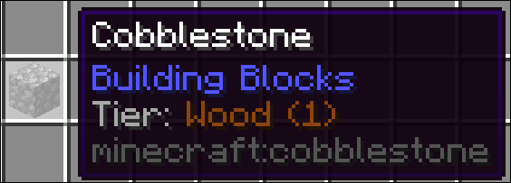

# Tool Tiers

ToolTiers modifies the vanilla tool system to be more robust and allow modpack authors to better configure what should be breakable with what

## Users

Users will notice a new line in their tooltips informing them of the tier of a given block (This also displays in Jade if you have it installed). 
By default, to mine a block, a tool will need to be the exact same tier, or a level above. The level is indicated by the number after the name



## Developers

Modpack Developers can use KubeJs to modify and add tiers. If a block has multiple tier tags the highest one will be used.

### Creating tiers

```js
// THIS IS A STARTUP EVENT

ToolTierEvents.register(event => {
  /**
   * This creates a new tool tier with the name 'Example', display color of pure white and level 3,
   * which is the same as iron. It can break all blocks below iron level and all blocks with the
   * same tier. It CANNOT break blocks at iron level. If you wish to change this
   * you have to modify the config to allow tiers to break the same level as them.
   */
  event.create("example", 0xFFFFFF, 3)

  /**
   * This creates a UNIQUE tier. Unique tiers can only break blocks with the exact same tier applied to them.
   * You can use this to make tools which can only break very specific blocks.
   */
  event.create("another", 0xFFFFFF)
})
```

### Registering items to tiers

```js
// THIS IS A STARTUP EVENT

/**
 * The first event parameter dictates the tier to register the items to.
 */
ToolTierEvents.tools('iron', event => {
  /**
   * This registers the 'example_mod:example_tool' item to the iron tier. 
   * Only the exact resource location works here as tags are not built yet.
   */
  event.add("example_mod:example_tool")
})
```

### Registering blocks to tiers

```js
ServerEvents.tags('block', event => {
  /**
   * Block Tiers are represented via tags, so you can use the default kubejs tag event here.
   * This registers the 'example_mod:example_block' to the diamond tier
   */
  event.add('tooltiers:requires/diamond', 'example_mod:example_block')

  /**
   * You can also remove tool requirements from a block like this
   */
  event.remove('tooltiers:requires/diamond', 'minecraft:netherite_block')
})
```